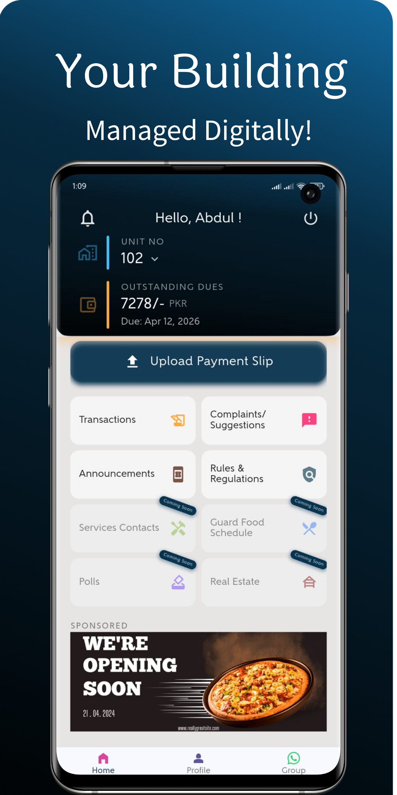
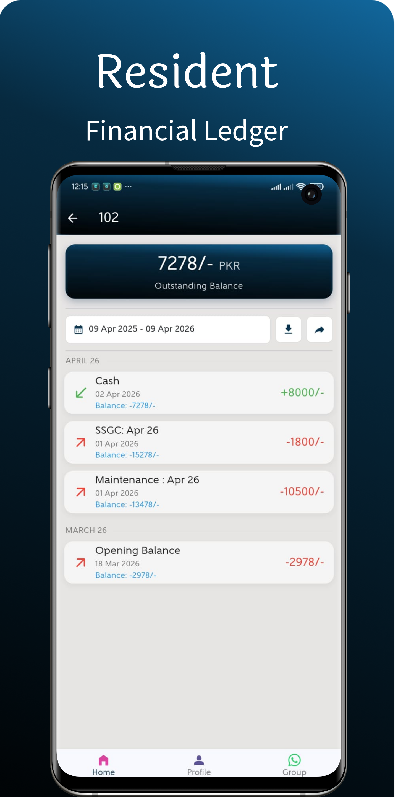
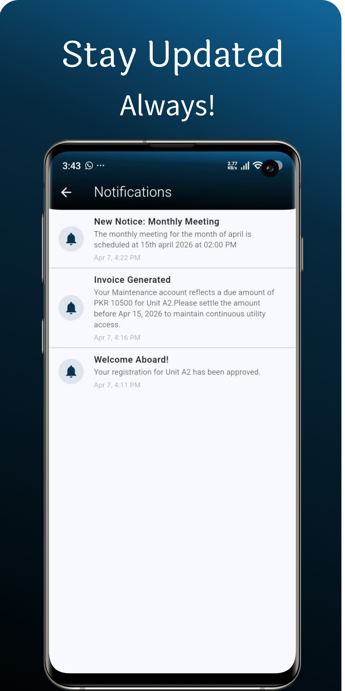
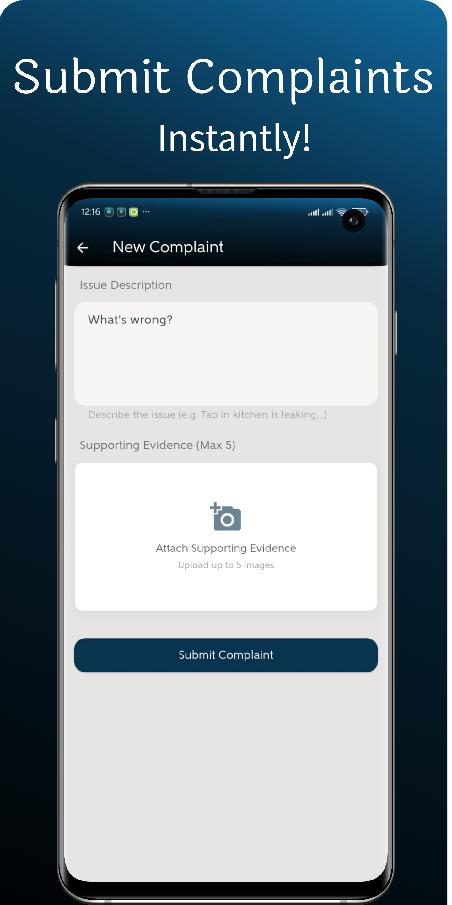

# Hi, I'm Fatima Tayyab 👋
### Mobile & Full-Stack Developer | Flutter Specialist

I am a software engineer dedicated to building high-performance, cross-platform mobile applications. I specialize in the **Flutter ecosystem** and **Full-Stack architecture**, with a focus on clean code and scalable state management.

---

## 🚀 Featured Projects

### 🏘️ Fixers | Community Management Platform
*A robust dual-interface mobile app for residential financial transparency.*
- **Status:** In Google Play Closed Testing Phase.
- **Tech Stack:** Flutter, BLoC (Feature-First), Node.js, PostgreSQL (Prisma), JWT.
- **Key Feature:** Automated financial ledgers for maintenance billing and expense tracking.
- **Backend:** Scalable RESTful API deployed on Railway.

  
  
  
  
  

### 📍 Travel Log | Personal Journey Tracker
*A cross-platform travel diary for modern explorers.*
- **Status:** 🚀 [**Live on Google Play Store**](https://play.google.com/store/apps/details?id=com.fsolutions.travellog3)
- **Tech Stack:** Flutter, Firebase (Auth/Firestore/FCM), Google Maps SDK.
- **Focus:** Real-time data syncing and smooth UI/UX with custom animations.

https://github.com/user-attachments/assets/ccad7145-5631-4e9c-8b5c-73b05d023b32

---

## 🛠️ Technical Toolbox

- **Frontend:** Flutter & Dart, BLoC, Provider, Responsive UI/UX.
- **Backend:** Node.js, RESTful APIs, PostgreSQL, Prisma ORM, PHP (MVC).
- **Cloud/DevOps:** Firebase, Railway, Git, CI/CD Workflows.
- **Architecture:** Clean Architecture, MVVM, Feature-First Design.

---

## 🎓 Academic Excellence
- **BS in Software Engineering:** Virtual University of Pakistan (**3.97 CGPA**).
- **HSC Computer Science:** Ranked **1st in Karachi** (Sir Syed Govt. Girls College).

---

## 📫 Connect with me
- **LinkedIn:** [linkedin.com/in/fatima-tayyab-3609928b](https://www.linkedin.com/in/fatima-tayyab-3609928b)
- **Email:** [fatimatayyab.dev@gmail.com](mailto:fatimatayyab.dev@gmail.com)
